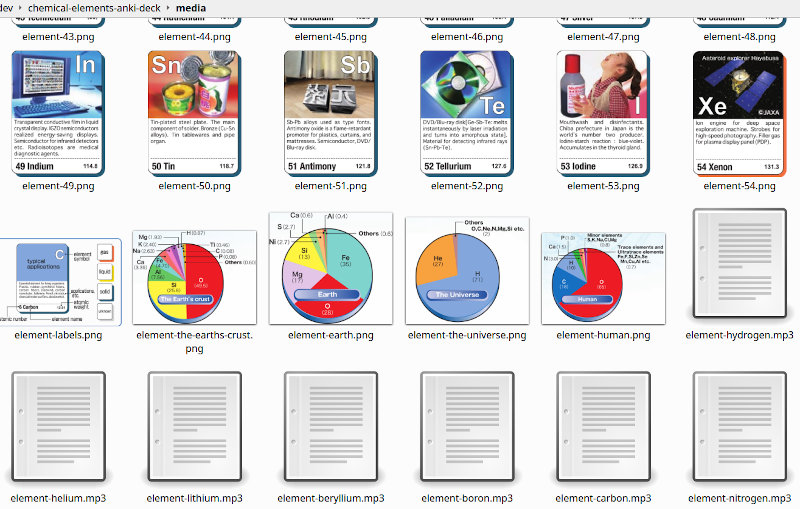

# chemical-elements-anki-deck

This is a repository for an Anki deck about the periodic table.

It's using the English posters provided by The Ministry of Education, Culture, Sports, Science and Technology of Japan and wikipedia.

 - https://www.mext.go.jp/stw/series.html
   - https://www.mext.go.jp/stw/common/pdf/series/diagram/uchuzu2018-en_A3.pdf
   - http://www.pcost.or.jp/_src/sc1617/englishversion_download.pdf

In addition to 118 elements, this deck contains the following notes.
```
 The lanthanoid series
 The actinoid series
 The Earth's crust
 Earth
 The universe
 Human
 The alkali metals
 The alkaline earth metals
 The noble gases
 The halogens
 The chalcogens
 The pnictogens
 The carbon group
 The boron group
 Transition metals
 The rare-earth elements
 The curled ribbon periodic table
 Water
 Stellar nucleosynthesis
 Formation of atoms
 The neutron stars
```
https://ankiweb.net/shared/info/1536392289


